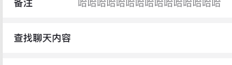
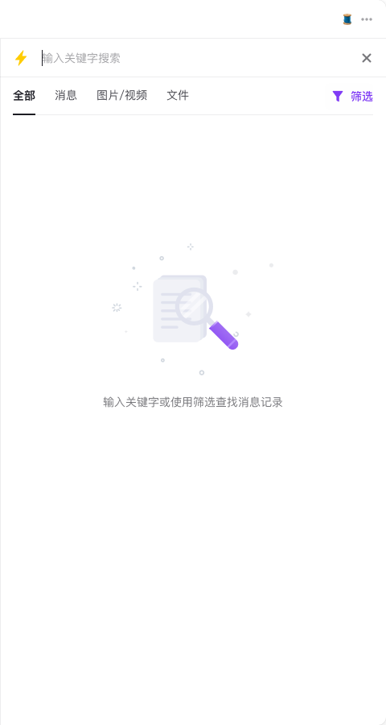
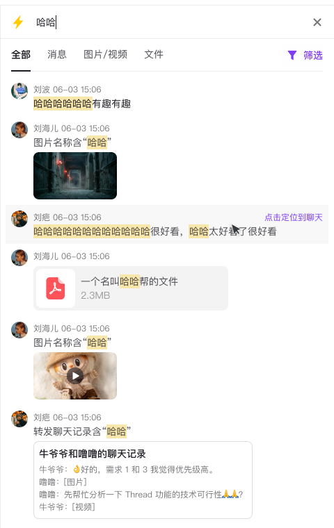
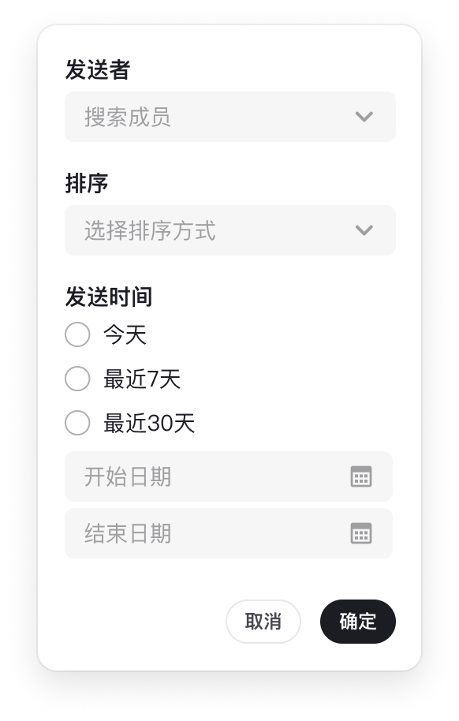
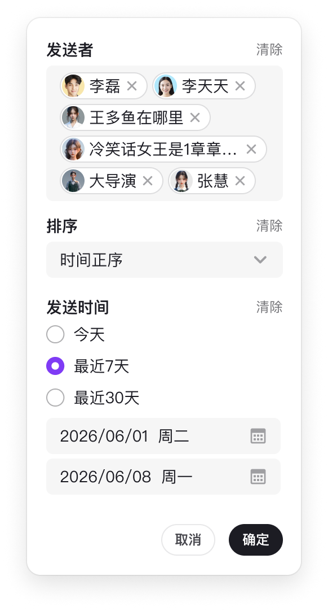
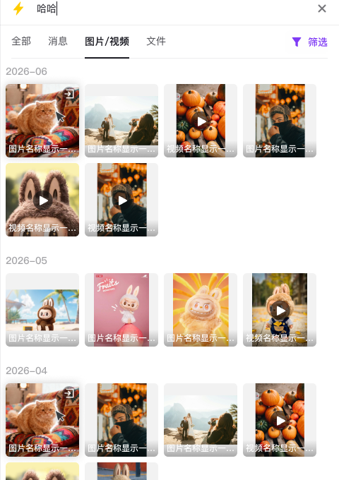
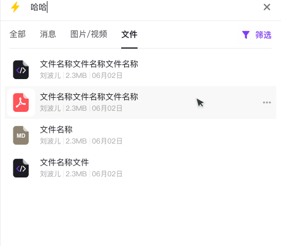
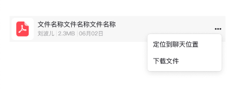

# 频道内聊天搜索前端实现方案

本文档用于拆解 Figma 设计稿中的频道内聊天搜索能力，并给出前端优先实现方案。当前后端接口尚未定稿，因此前端应先定义稳定的 UI 数据模型和适配层；后续真实接口落地后，主要替换 adapter，不改动主体 UI。

## 范围

这次要做的是**频道内聊天内容搜索**，入口来自聊天信息面板里的“查找聊天内容”。它不是全局搜索，也不建议简单恢复旧版 `GlobalSearch` 弹窗。目标交互是：在当前会话右侧打开搜索面板，用户可以搜索、筛选、查看结果，并定位回对应聊天消息。

首轮不覆盖：

- 联系人、群组等全局搜索。
- 后端搜索排序、分词、召回策略。
- 图片/视频预览播放的完整交互，首轮只需要结果展示和定位。

## 当前实现状态

当前已先按 mock adapter 实现 UI 交互展示，核心代码在 `packages/dmworkbase/src/Components/ChannelSearch/`，入口接入在 `packages/dmworkbase/src/module.tsx` 和 `packages/dmworkbase/src/Pages/Chat/index.tsx`。视觉样式已用 Figma API 的节点数据重新校准；文档内截图只用于说明效果，不作为样式实现来源。

已实现：

- 从聊天信息面板的“查找聊天内容”打开右侧独立搜索面板。
- 搜索输入、中文输入法 composition guard、请求防抖、请求竞态保护。
- `全部 / 消息 / 图片/视频 / 文件` 四个 tab。
- 文字、图片/视频、文件、合并转发记录的 mock 结果展示和关键词高亮。
- 发送者、排序、发送时间筛选弹层，以及筛选数量和清除入口。
- 图片/视频按月份分组，使用 Figma Images API 导出的节点缩略图资源，视频展示播放标识，hover 展示定位入口。
- 文件结果右侧更多操作菜单，包含“定位到聊天位置”和“下载文件”。
- Storybook 预览：`Chat/ChannelSearch`，可独立验证搜索、tab、筛选和文件操作菜单。

后续接真实后端时，优先替换 `adapter.ts`，UI 层保持依赖标准化后的 `ChannelSearchItem`。

## Figma API 校准记录

设计稿来源：Figma file `Dlbb92GOXdv9PGTSVQBsCg`，搜索根节点 `2079:5169`。实现时使用 `/v1/files/.../nodes?ids=2079:5169&geometry=paths` 提取布局、颜色、字体和效果，再用 `/v1/images/...` 导出必要节点资源。

关键节点与落地值：

- 搜索面板：`2129:6558` / `2142:6086` / `2142:10384` / `2142:11112`，宽 `480px`，背景 `#FFFFFF`，描边 `rgba(28,28,35,0.08)`，搜索结果态无大投影。
- 顶部搜索栏：`2129:6560`，高 `48px`，padding `12px 16px`，输入文字 `PingFang SC 400 14px/20px`，placeholder `rgba(28,28,35,0.4)`。
- tab 区：`2142:6096`，高 `47px`，左右 padding `16px`，tab gap `24px`；active 字重 `600`、颜色 `#1C1C23`，inactive `rgba(28,28,35,0.8)`；筛选按钮高 `32px`、半径 `6px`、文字 `#7F3BF5`。
- 结果列表：`2142:6573`，列表宽 `464px`，相对面板左偏移 `8px`；消息行内 padding `8px`，头像 `24px`，meta `12px/20px rgba(28,28,35,0.6)`，正文 `14px/20px`。
- 关键词高亮：`2142:6599` 等矩形节点，背景 `#F8E6AB`，高度随 `20px` 行高，不做额外圆角和 padding。
- 筛选浮层：`2142:7423`，宽 `243px`，半径 `12px`，阴影 `0 8px 24px rgba(0,0,0,0.12)` + `0 0 0 1px rgba(0,0,0,0.06)`；表单标题 `600 14px/20px`，输入背景 `rgba(28,28,35,0.04)`，高度 `32px`。
- 图片/视频网格：`2168:12559`，分组 gap `24px`，月份标题 `500 14px/20px rgba(28,28,35,0.4)`，缩略图 `104px * 104px`，grid gap `8px`，圆角约 `5.47px`，投影 `0 0 13px rgba(0,0,0,0.2)`。
- 文件列表：`2142:11134`，行高 `56px`，文件图标容器 `48px * 48px`，文件名 `400 14px/20px #1C1C23`，meta `400 12px/20px rgba(28,28,35,0.4)`。

已导出的组件资源：

- 空态插画：`packages/dmworkbase/src/Components/ChannelSearch/assets/figma-empty-search.png`，来自节点 `2142:5818`。
- 文件图标：`packages/dmworkbase/src/Components/ChannelSearch/assets/figma-file-icon.png`，来自节点 `2168:12073`。
- 媒体缩略图：`packages/dmworkbase/src/Components/ChannelSearch/assets/figma-media-01.png` 至 `figma-media-08.png`，来自 `2168:12319`、`2168:12321`、`2168:12323`、`2168:12325`、`2168:12377`、`2168:12494`、`2168:12500`、`2168:12508`。
- 发送者头像：`figma-avatar-liubo.png`、`figma-avatar-liuhaier.png`、`figma-avatar-liuba.png`，来自 Figma image fill 导出，用于 Storybook 视觉校准，避免本地头像接口不可用时退化成灰色占位。
- “全部”页内联媒体：`figma-inline-image-01.png`、`figma-inline-video-01.png`，分别对应节点 `2142:6613`、`2142:6671` 附近的 `120px * 68px` 消息内缩略图。
- 文件类型图标：`figma-file-pdf.png`、`figma-file-md.png`、`figma-file-code.png`，来自 Figma 节点渲染导出；文件 Tab 使用紧凑列表行，“全部”页文件结果使用消息内文件卡片，二者不共用布局。

## 设计稿切片

### 入口

入口位于聊天信息面板内，点击“查找聊天内容”后打开当前频道的搜索面板。



### 空态

搜索面板顶部包含搜索输入框、四个 tab 和筛选入口。未输入关键词且没有筛选条件时展示空态。



### 全部结果

“全部”按时间倒序混排文字、图片/视频、文件、转发聊天记录等结果。命中的关键词需要黄色高亮，不同消息类型展示不同摘要。



### 筛选弹层

筛选包含发送者、排序、发送时间快捷项和自定义日期范围。设置筛选后，筛选入口展示数量，并提供清除能力。



已选择筛选项时，弹层内展示已选发送者、已选排序和日期范围。



### 图片/视频

“图片/视频”按月份分组，以网格展示缩略图；视频需要播放标识，hover 时展示定位到聊天的入口。



### 文件

“文件”以紧凑列表展示文件图标、文件名、发送者、大小和日期。文件名命中关键词时高亮。文件行右侧有更多操作菜单，至少包含“定位到聊天位置”和“下载文件”。





## 现有能力复用

### 入口注册

`packages/dmworkbase/src/module.tsx` 里已经有被隐藏的 `channel.base.settingMessageHistory` 注册点，可以作为入口恢复的基础。

旧逻辑：

- 在聊天信息面板中展示“查找聊天内容”。
- 点击后通过 `WKApp.shared.baseContext.showGlobalModal` 打开 `GlobalSearch`。
- 结果点击走 `handleGlobalSearchClick`。

新逻辑：

- 保留“查找聊天内容”入口。
- 点击后打开新的 `ChannelSearchPanel`，挂到聊天页右侧面板体系。
- 当前频道内的结果优先使用 `conversationContext.locateMessage(messageSeq)` 定位。

### 右侧面板壳

`ChatContentPage` 已经有频道设置面板、thread/file/matter 等右侧面板布局。搜索不应该塞进 `.wk-chat-channelsetting` 里面伪装成设置页，而应增加独立的搜索面板状态和样式类。

建议新增布局变量：

```css
:root {
  --wk-width-chat-search-panel: 480px;
}
```

搜索面板可以复用右侧绝对定位和宽度压缩思路，但要避免和频道设置面板强耦合。后续子区场景还会影响布局，独立面板类更容易扩展。

### 搜索 VM 行为

现有 `GlobalSearchVM` 里有几类行为值得复用或照搬：

- 输入防抖。
- 中文输入法 composition guard。
- `requestId` 防止旧请求覆盖新请求。
- 分页状态。
- 搜索错误状态。
- 使用 `MessageContentManager` 解码 payload。

但不建议直接复用 `GlobalSearch` UI。它是全局搜索形态，频道模式只有 `all/files`，与新设计里的 `全部/消息/图片/视频/文件` 不一致。

### 定位消息

`Conversation.locateMessage(messageSeq)` 已经支持：

- 定位可见消息并高亮。
- 折叠会话展开后再定位。
- 当前消息不在本地列表时，先加载包含该 `messageSeq` 的消息页，再定位。

搜索结果点击优先走：

```ts
conversationContext.locateMessage(item.messageSeq);
```

如果结果属于其他频道、子区或当前未激活的会话面，则降级走 `ShowConversationOptions.initLocateMessageSeq`。

### 文件工具

现有全局搜索文件结果已经用到：

- `FileHelper.getFileIconInfo`。
- `FileHelper.getFileSizeFormat`。
- `getTimeStringAutoShort2`。
- `sanitizeHighlight`。

这些 helper 可以复用，但文件结果 UI 建议重做，以贴合设计稿。

## 前端模块拆分

建议新增独立模块：

```txt
packages/dmworkbase/src/Components/ChannelSearch/
  index.tsx
  index.css
  vm.ts
  types.ts
  adapter.ts
  mock.ts
  assets/
    figma-empty-search.png
    figma-file-icon.png
    figma-media-*.png
  components/
    SearchHeader.tsx
    SearchTabs.tsx
    SearchEmpty.tsx
    FilterPopover.tsx
    ResultList.tsx
    MessageResultItem.tsx
    MediaResultGrid.tsx
    FileResultItem.tsx
    MergeForwardResultItem.tsx
    HighlightText.tsx
```

### `ChannelSearchPanel`

负责面板外壳和主 UI：

- 搜索输入框。
- 关闭按钮。
- tab 切换。
- 筛选按钮和筛选数量。
- 内容滚动区。
- loading、empty、no-result、error、load-more 状态。

建议 props：

```ts
interface ChannelSearchPanelProps {
  channel: Channel;
  conversationContext: ConversationContext;
  onClose: () => void;
}
```

### `ChannelSearchVM`

负责状态和副作用：

- `keyword`。
- `activeTab`。
- `filters`。
- `itemsByTab`。
- `page/cursor`。
- `loading`、`loadingMore`、`hasMore`、`error`。
- `requestId` 请求竞态保护。
- 筛选弹层里的发送者搜索状态。

实现风格建议沿用 dmworkbase 现有的 `Provider` / `ProviderListener` 模式。

### `adapter.ts`

adapter 是隔离后端不确定性的核心边界。

职责：

- 将 `ChannelSearchQuery` 转成接口参数。
- 在 mock、现有 `/search/global`、未来 `/search/channel` 之间切换。
- 将服务端结果标准化成 `ChannelSearchItem`。
- 将后端高亮字段转成安全的 React 渲染数据。
- 当后端返回原始消息 payload 时，负责解析 payload。

原则：UI 组件不直接依赖后端原始字段名，所有字段差异都在 adapter 内消化。

## UI 标准数据模型

```ts
export type ChannelSearchTab = "all" | "message" | "media" | "file";

export type ChannelSearchItemKind =
  | "text"
  | "image"
  | "video"
  | "file"
  | "merge_forward"
  | "rich_text"
  | "unknown";

export interface ChannelSearchQuery {
  channelId: string;
  channelType: number;
  keyword: string;
  tab: ChannelSearchTab;
  senderUids: string[];
  sort: "time_desc" | "time_asc";
  startAt?: number;
  endAt?: number;
  cursor?: string;
  limit: number;
}

export interface ChannelSearchHighlightRange {
  field: "text" | "file.name" | "media.name" | "forward.snippet";
  ranges: Array<[number, number]>;
}

export interface ChannelSearchItem {
  id: string;
  messageId: string;
  messageSeq: number;
  channelId: string;
  channelType: number;
  sender: {
    uid: string;
    name: string;
    avatar?: string;
  };
  timestamp: number;
  kind: ChannelSearchItemKind;
  text?: string;
  matchReason?: string;
  file?: {
    name: string;
    size?: number;
    iconUrl?: string;
    url?: string;
  };
  media?: {
    name?: string;
    thumbUrl: string;
    url?: string;
    duration?: number;
  };
  forward?: {
    title: string;
    snippets: string[];
  };
  highlights: ChannelSearchHighlightRange[];
  raw?: unknown;
}

export interface ChannelSearchResponse {
  items: ChannelSearchItem[];
  nextCursor?: string;
  hasMore: boolean;
}
```

## 建议接口格式

如果后端可以配合，建议提供频道内搜索接口：

```http
POST /search/channel
```

请求：

```json
{
  "channel_id": "xxx",
  "channel_type": 2,
  "keyword": "哈哈",
  "tab": "all",
  "sender_uids": ["u1", "u2"],
  "sort": "time_desc",
  "start_at": 1780243200,
  "end_at": 1780847999,
  "cursor": "",
  "limit": 20
}
```

响应：

```json
{
  "items": [
    {
      "id": "msg_1",
      "message_id": "123",
      "message_seq": 456,
      "channel_id": "xxx",
      "channel_type": 2,
      "from_uid": "u1",
      "from_name": "刘波",
      "timestamp": 1780470360,
      "kind": "text",
      "text": "哈哈哈哈哈哈有趣有趣",
      "highlights": [
        {
          "field": "text",
          "ranges": [
            [0, 2],
            [2, 4]
          ]
        }
      ]
    }
  ],
  "next_cursor": "cursor-token",
  "has_more": true
}
```

关键要求：

- `message_seq` 必须返回，用于定位聊天。
- 即使是频道内搜索，也建议返回 `channel_id` 和 `channel_type`，后续子区/跨会话定位会用到。
- `kind` 尽量由后端标准化，前端 adapter 做兜底。
- 高亮建议返回 ranges，不建议长期返回 HTML。前端可以安全且统一地渲染高亮。
- 图片/视频必须有缩略图字段；视频需要 `duration` 或明确的 media type。

## 交互细节

### 搜索输入

- 输入防抖 300ms。
- 兼容中文输入法 composition。
- 清空关键词后重置搜索结果。
- 关键词或筛选变化时触发搜索。
- 无关键词且无筛选时展示空态。
- 无关键词但有筛选时，如果后端支持，可以搜索符合筛选条件的历史记录。

### Tabs

- `all`：展示所有支持的消息类型。
- `message`：只展示文字、富文本、转发聊天记录。
- `media`：只展示图片和视频，并按 `YYYY-MM` 分组。
- `file`：只展示文件。

Tab 切换策略：

- 同 query key 下已有缓存时复用缓存。
- 无缓存时发起对应 tab 的搜索请求。

query key 至少包含：channel、keyword、tab、filters、sort。

### 筛选弹层

筛选状态建议：

```ts
interface ChannelSearchFilters {
  senderUids: string[];
  sort: "time_desc" | "time_asc";
  datePreset?: "today" | "last_7_days" | "last_30_days";
  startAt?: number;
  endAt?: number;
}
```

规则：

- 筛选数量按字段组计数，不按选项数量计数。
- 发送者可逐个删除。
- 时间快捷项和自定义日期范围互斥。
- “清除”重置筛选并重新搜索。
- “确定”应用筛选；“取消”关闭弹层且不提交草稿状态。

### 结果点击和 hover

- 消息结果 hover 时展示“点击定位到聊天”。
- 图片/视频 hover 时展示定位 icon。
- 文件结果右侧展示更多操作菜单，菜单项包含“定位到聊天位置”和“下载文件”；搜索场景下建议将“定位到聊天位置”放在第一项。
- 定位后默认不关闭搜索面板，方便用户连续查看多个结果。

### 子区 / Thread 场景

设计稿里有一条说明：子区的聊天记录搜索点开后，子区位置向左移动顶掉群聊区。这个不建议当成普通 CSS 微调处理，而应该作为布局跟进项。

推荐路径：

1. 先完成当前激活频道的普通搜索。
2. 抽象出 `main conversation + search panel` 的 panel host。
3. 子区搜索时，让子区会话成为主会话区域，再在右侧挂搜索面板。

这样可以避免 `thread panel + channel setting + search panel` 多层叠加后难以维护。

## 开发优先级

### P0：面板壳和 mock 数据

- 新增 `ChannelSearchPanel` 模块。
- 在聊天页增加右侧搜索面板状态。
- 恢复“查找聊天内容”入口，并打开新面板。
- 添加四个 tab 的 mock adapter 数据。
- 渲染 empty、loading、error、no-result 状态。

交付目标：不依赖后端即可打开并视觉验收搜索面板。

### P1：消息搜索 MVP

- 打通关键词搜索和 adapter。
- 实现 `all` 和 `message` tab。
- 实现安全高亮渲染。
- 文字和转发聊天记录支持定位回聊天。
- 支持分页 / 加载更多。

交付目标：用户可以搜索文字类聊天记录并定位消息。

### P2：文件 tab

- 实现文件列表。
- 复用文件 icon、大小、时间格式化工具。
- 文件名关键词高亮。
- 实现文件行右侧更多操作菜单，包含“定位到聊天位置”和“下载文件”。

交付目标：文件名搜索可用。

### P3：筛选能力

- 实现筛选弹层，并区分 draft/applied state。
- 发送者搜索可以先基于频道成员做本地兜底。
- 展示筛选数量和清除入口。
- 筛选变化后刷新 query key 和结果缓存。

交付目标：发送者、时间、排序筛选可用。

### P4：图片/视频和子区布局

- 实现按月份分组的媒体网格。
- 添加缩略图兜底和视频标识。
- hover 显示定位 icon。
- 在确认 panel host 后实现子区特殊布局。

交付目标：媒体搜索和子区搜索贴近设计稿。

## 测试和验收

单元测试建议：

- adapter 能标准化 text、file、image、video、merge-forward、unknown payload。
- 高亮 ranges 渲染安全，不注入 HTML。
- keyword、tab、sort、date、sender 变化时 query key 正确变化。
- `requestId` 能忽略过期响应。
- 筛选弹层的取消/确定行为正确。

交互测试建议：

- 从聊天信息面板打开搜索时，传入当前 channel。
- 关闭搜索后恢复原聊天布局。
- 点击结果调用 `locateMessage(messageSeq)`。
- 加载更多不会重复插入结果。
- tab 切换在 query 未变化时复用缓存。

手动验收建议：

- default、loading、empty、no-result、error 状态。
- 长文件名、长发送者名称。
- 窄面板宽度和 dark mode。
- 后续接入 i18n 后检查 `zh-CN` 和 `en-US` 文案布局。

## 待确认问题

- 定位后是否关闭搜索面板？建议不关闭。
- 无关键词但有筛选时是否查询全部历史？建议后端支持则前端支持。
- GIF、富文本内图片是否归入图片/视频 tab？建议有缩略图或图片 URL 时归入媒体。
- 后端是否返回 HTML 高亮？建议不要返回 HTML，返回 ranges。
